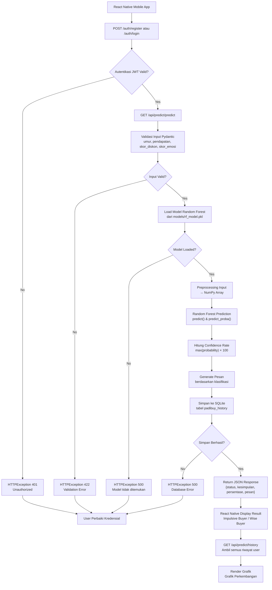

# PadiBuy - Prediction of Impulsive Buying

## Deskripsi Proyek

PadiBuy adalah sistem prediksi perilaku belanja impulsif berbasis machine learning yang dibangun menggunakan FastAPI (backend) dan React Native (mobile). Sistem ini menggunakan algoritma Random Forest untuk menganalisis pola belanja pengguna berdasarkan data demografis dan psikologis, kemudian memberikan klasifikasi apakah pengguna termasuk **Impulsive Buyer** (pembeli impulsif) atau **Wise Buyer** (pembeli bijak).

### Tujuan
- Memprediksi kecenderungan perilaku belanja impulsif pengguna
- Memberikan insight pengguna tentang pola keuangan mereka
- Menyimpan riwayat prediksi untuk analisis tren perkembangan
- Menjadi sistem pendukung keputusan financial literacy

### Teknologi
- **Backend**: FastAPI, SQLAlchemy, SQLite
- **ML Engine**: Scikit-learn (Random Forest), Joblib
- **Auth**: JWT (JSON Web Token)
- **Mobile**: React Native (client)

### Fitur Utama
- Autentikasi JWT (Register & Login)
- Prediksi perilaku belanja impulsif via `/api/predict/predict`
- Riwayat prediksi per user via `/api/predict/history`
- Database SQLite untuk penyimpanan history

---

## Flowchart Sistem PadiBuy



---

## Algoritma PadiBuy

### 1. Algoritma Random Forest (Machine Learning)

**Input**: 4 fitur numerik
- `umur` (int): Usia pengguna
- `pendapatan` (float): Pendapatan bulanan pengguna
- `skor_diskon` (int): Skala 1-5, seberapa tertarik dengan diskon
- `skor_emosi` (int): Skala 1-5, belanja saat stres/senang

**Proses**:
1. **Preprocessing**: Input dikonversi menjadi numpy array 2D `[[umur, pendapatan, skor_diskon, skor_emosi]]`
2. **Prediksi**: `model.predict(input_array)` → output binary (0 atau 1)
   - `0` = Wise Buyer (pembeli bijak)
   - `1` = Impulsive Buyer (pembeli impulsif)
3. **Confidence Score**: `model.predict_proba(input_array)` → probabilitas maksimum dikalikan 100 untuk mendapatkan persentase keyakinan
4. **Message Generation**: Berdasarkan hasil prediksi, sistem menghasilkan pesan yang relevan untuk pengguna

**Output**:
```json
{
  "is_impulsive": 1,
  "confidence_percentage": 87.45,
  "message": "Berdasarkan jawaban Anda, Anda cenderung melakukan pembelian impulsif..."
}
```

### 2. Algoritma API Endpoint

#### A. POST `/auth/register`
```
Input: {email, username, password}
1. Cek apakah email sudah terdaftar → Jika ya, return error 400
2. Cek apakah username sudah digunakan → Jika ya, return error 400
3. Hash password menggunakan bcrypt
4. Simpan user baru ke tabel users
5. Return user data (tanpa password)
```

#### B. POST `/auth/login`
```
Input: {email, password} (OAuth2 form)
1. Query user by email
2. Verifikasi password dengan bcrypt
3. Jika valid, generate JWT token (exp: 30 menit)
4. Return {access_token, token_type: "bearer"}
```

#### C. POST `/api/predict/predict`
```
Input: {umur, pendapatan, skor_diskon, skor_emosi} + JWT Token
1. Verifikasi JWT token → Extract user_id
2. Validasi input menggunakan Pydantic BaseModel
3. Susun fitur_input = [umur, pendapatan, skor_diskon, skor_emosi]
4. Panggil hitung_prediksi_impulsive(fitur_input)
   a. Load model .pkl (caching global untuk performa)
   b. Prediksi dengan Random Forest
   c. Hitung confidence rate
5. Simpan hasil ke tabel padibuy_history
6. Return JSON response dengan kesimpulan dan persentase
```

#### D. GET `/api/predict/history`
```
Input: JWT Token
1. Verifikasi JWT token → Extract user_id
2. Query semua riwayat dari padibuy_history WHERE user_id = current_user.id
3. Return list riwayat untuk grafik perkembangan
```

### 3. Algoritma Database

**Tabel Users**:
```sql
CREATE TABLE users (
    id INTEGER PRIMARY KEY,
    email VARCHAR UNIQUE NOT NULL,
    username VARCHAR UNIQUE NOT NULL,
    hashed_password VARCHAR NOT NULL,
    is_active BOOLEAN DEFAULT TRUE,
    created_at DATETIME DEFAULT NOW()
)
```

**Tabel PadiBuyHistory**:
```sql
CREATE TABLE padibuy_history (
    id INTEGER PRIMARY KEY,
    user_id INTEGER FOREIGN KEY REFERENCES users(id),
    umur INTEGER NOT NULL,
    pendapatan FLOAT NOT NULL,
    skor_diskon INTEGER NOT NULL,
    skor_emosi INTEGER NOT NULL,
    is_impulsive INTEGER NOT NULL,
    confidence_rate FLOAT NOT NULL,
    created_at DATETIME DEFAULT NOW()
)
```

---

## Setup & Instalasi

### 1. Clone Repository
```bash
git clone <repository-url>
cd predibuy
```

### 2. Install Dependencies
```bash
pip install -r requirements.txt
```

### 3. Konfigurasi Environment
Edit file `.env` sesuai kebutuhan:
```env
DATABASE_URL=sqlite:///./padibuy.db
MODEL_PATH=models/rf_model.pkl
SECRET_KEY=padibuy-secret-key-change-in-production
ACCESS_TOKEN_EXPIRE_MINUTES=30
```

### 4. Training Model Random Forest
```python
# Simpan model sebagai models/rf_model.pkl
import joblib
from sklearn.ensemble import RandomForestClassifier

# ... training code ...
joblib.dump(model, "models/rf_model.pkl")
```

### 5. Jalankan Server
```bash
uvicorn app.main:app --reload
```

### 6. Akses Dokumentasi API
- Swagger UI: `http://localhost:8000/docs`
- ReDoc: `http://localhost:8000/redoc`

---

## Contoh Request/Response

### Register User
**Request**:
```json
POST /auth/register
{
  "email": "user@example.com",
  "username": "pembeli_cerdas",
  "password": "password123"
}
```

**Response**:
```json
{
  "id": 1,
  "email": "user@example.com",
  "username": "pembeli_cerdas",
  "is_active": true
}
```

### Login
**Request**:
```json
POST /auth/login
Form Data: username=user@example.com&password=password123
```

**Response**:
```json
{
  "access_token": "eyJhbGciOiJIUzI1NiIsInR5cCI6IkpXVCJ9...",
  "token_type": "bearer"
}
```

### Prediksi Perilaku Belanja
**Request**:
```json
POST /api/predict/predict
Headers: Authorization: Bearer <token>
{
  "umur": 21,
  "pendapatan": 3500000,
  "skor_diskon": 5,
  "skor_emosi": 4
}
```

**Response**:
```json
{
  "status": "success",
  "aplikasi": "PadiBuy Mobile",
  "data": {
    "id_riwayat": 1,
    "kesimpulan": "Impulsive Buyer",
    "persentase_kecenderungan": 87.45,
    "pesan": "Berdasarkan jawaban Anda, Anda cenderung melakukan pembelian impulsif..."
  }
}
```

### Ambil Riwayat Prediksi
**Request**:
```json
GET /api/predict/history
Headers: Authorization: Bearer <token>
```

**Response**:
```json
{
  "status": "success",
  "riwayat_user": [
    {
      "id": 1,
      "user_id": 1,
      "umur": 21,
      "pendapatan": 3500000.0,
      "skor_diskon": 5,
      "skor_emosi": 4,
      "is_impulsive": 1,
      "confidence_rate": 87.45,
      "created_at": "2024-01-15T10:30:00"
    }
  ]
}
```

---

## Integrasi React Native

### Contoh kode fetch dari React Native:
```javascript
const predictPadiBuy = async (userData, token) => {
  const response = await fetch('http://your-vps-ip:8000/api/predict/predict', {
    method: 'POST',
    headers: {
      'Content-Type': 'application/json',
      'Authorization': `Bearer ${token}`
    },
    body: JSON.stringify({
      umur: userData.umur,
      pendapatan: userData.pendapatan,
      skor_diskon: userData.skor_diskon,
      skor_emosi: userData.skor_emosi
    })
  });
  return await response.json();
};
```

---

## Kontributor
Proyek UAS PadiBuy - Prediction of Impulsive Buying
